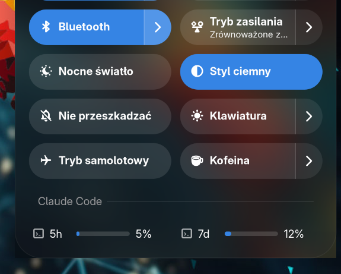

# Claude Code Usage — GNOME Shell extensions

Two small GNOME Shell extensions that show [Claude Code](https://www.anthropic.com/claude-code)'s usage limits (5-hour session and 7-day windows) directly in the system Quick Settings menu. Both read the existing login credentials from `~/.claude/.credentials.json` — the same file the Claude Code CLI itself uses — so there's nothing extra to sign in to.

Not affiliated with or endorsed by Anthropic.

## claude-usage-bars

Two always-visible progress bars, side by side, pinned to the bottom of the Quick Settings menu. No clicking required.



## claude-quick-settings ("Minimal")

A single tile next to Wi-Fi and Bluetooth showing a compact summary; click it to expand full details (percentages, reset countdowns).

## Installing

```sh
mkdir -p ~/.local/share/gnome-shell/extensions/<uuid>
cp claude-usage-bars/* ~/.local/share/gnome-shell/extensions/claude-usage-bars@Kr1sCode.github.io/
gnome-extensions enable claude-usage-bars@Kr1sCode.github.io
```

(Substitute `claude-quick-settings` for the other extension.) On Wayland, a brand new extension is only picked up after logging out and back in.

## License

GPL-2.0-or-later — see [LICENSE](LICENSE).
